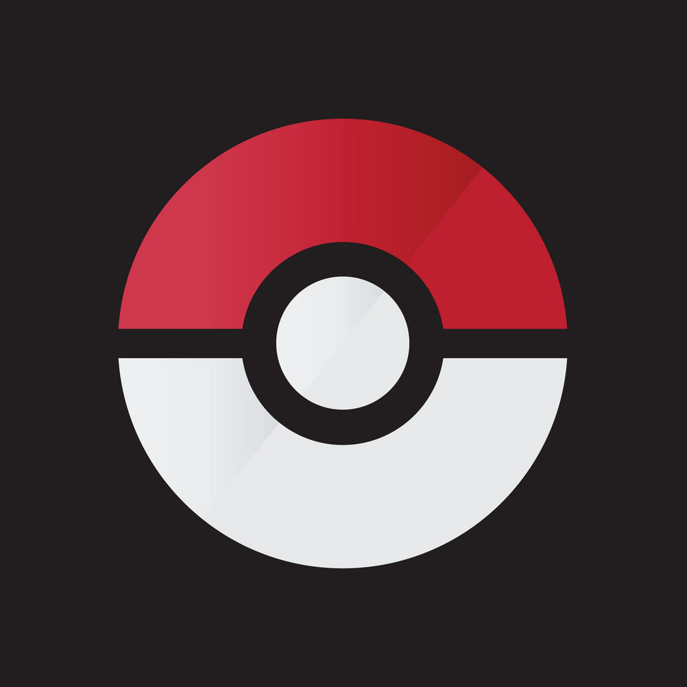

<!-- PROJECT LOGO -->
 

  

  <h3 align="center">Pokemon Test app</h3>

  

    An awesome iOS project with Poke API
     
  

<!-- ABOUT THE PROJECT -->
## About The Project

[![Product Name Screen Shot][product-screenshot]

Pokemon Test App it's an iOS project written in native Swift language. The app is compatible with iOS 11.0 and later and with iPadOS. The apps use the PokeApi to show the a list of Pokemon and their details. The app provides also a search bar to search a pokemon

## Architecture
The architecture it's a classic MVVM-c clean architecture. A main container resolves the DI for the flow DataSorce->Repository->UseCases. An instance of the main container it's passed to the main coordinator to resolve the dipendences of the Domain level, where the view-model needs specifics use-cases to be instantiated. The complete flow is: View -> ViewController -> ViewModel -> UseCases -> Repository -> DataSource. The view-model informs the view-controller using a state. 

## Folder Structure
* App
Contains AppDelegate and LaunchScreen
* PKMNDI
Contains the protocol and implementation of Main Container
* PKMNData
Contains the network layer classes and the managers for API calls and JSON mock calls
* PKMNCore
Contains the helper classes and the implementation of common classes of the app
* PKMNDomain
Contains entities models, the data models, the usecases and the repositories
* PKMNavigation
Contains the protocols and the implementations of the Coordinators
* Scenes
Contains the viewmodels, the viewcontrollers, the views and the assemblers for every scene.

The app use the library `Anchorage` (https://github.com/Rightpoint/Anchorage) to improve and fasts the UI build process. Use also a modded library written to get main colors from an image

[product-screenshot]: images/devices.jpeg
